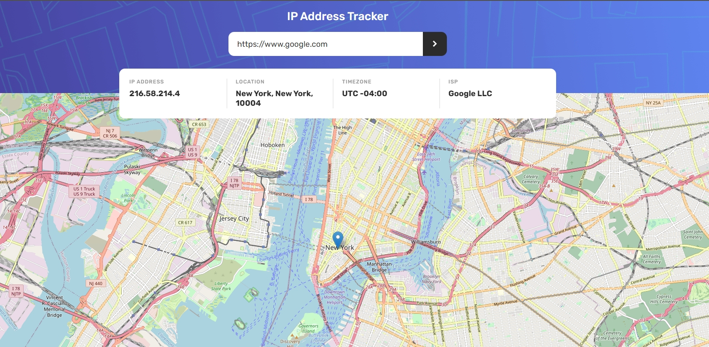
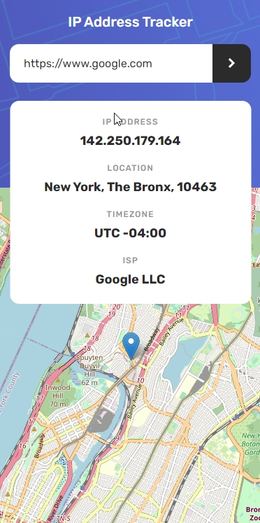

This is a solution to the [IP address tracker challenge on Frontend Mentor](https://www.frontendmentor.io/challenges/ip-address-tracker-I8-0yYAH0).

### The challenge

Users should be able to:

- View the optimal layout for each page depending on their device's screen size
- See hover states for all interactive elements on the page
- See their own IP address on the map on the initial page load
- Search for any IP addresses or domains and see the key information and location

### Screenshot

### Links

- [Live Site URL](https://eugiss.github.io/IP-address-tracker/)

## My process

### Built with

- Semantic HTML5 markup
- CSS custom properties
- Flexbox
- JS
- Mobile-first workflow

Also used:

- [Leafletjs](https://leafletjs.com/)
- [ip-api](https://ip-api.com/)
- [Moment Timezone](https://momentjs.com/timezone/)
- [cors-anywhere](https://cors-anywhere.herokuapp.com/) - as a wrapper for an http request for correct display on the site

## Author

- Github - [EugiSs](https://github.com/EugiSs)
- Frontend Mentor - [@Eugi](https://www.frontendmentor.io/profile/EugiSs)
